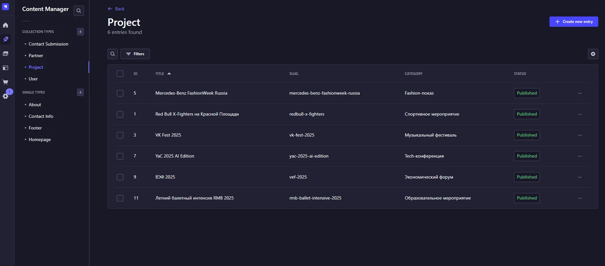
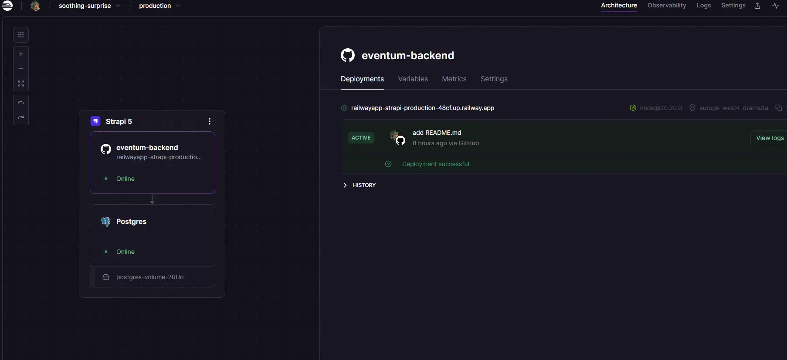

# Eventum — backend для лендинга ивент-индустрии 

**Admin Strapi:** [railwayapp-strapi-production-48cf.up.railway.app](https://railwayapp-strapi-production-48cf.up.railway.app/admin/)

Frontend (Next.js): [eventum-frontend-git](https://github.com/ImbaSharikAnirum/eventum-frontend?tab=readme-ov-file)

## Скриншоты

---

Демо-проект лендинга для **ивент-индустрии** с динамическим управлением контентом через **Strapi CMS**.

Проект выполнен в рамках **тестового задания на позицию Middle+ Fullstack разработчика**  
с фокусом на:
- семантику и архитектуру кода
- UX-логику и интерактивность
- визуальную составляющую и анимации
- удобную и масштабируемую Strapi-админку

---

### Backend
- **Strapi 5.11.3**
- Bootstrap-инициализация данных при первом запуске
- Полностью настроенные Public API-права
- База данных: PostgreSQL на Railway
- Хранение медиа: Cloudinary

---

## Архитектура Strapi

### Single Types
- `homepage` — Hero-секция и SEO
- `about` — описание компании и статистика
- `contact-info` — контакты, соцсети, координаты карты, опции формы
- `footer` — структура футера и ссылки

### Collection Types
- `project` — проекты / кейсы с галереями и страницами-углублениями
- `partner` — партнёры и клиенты
- `contact-submission` — заявки из формы обратной связи со статусами

### Компоненты
Переиспользуемые shared-компоненты:
- статистика
- соцсети
- опции услуг
- группы ссылок футера

**Весь контент управляется через Strapi без изменений кода.**

---